## 1.Screenshots

- **Landing Page**
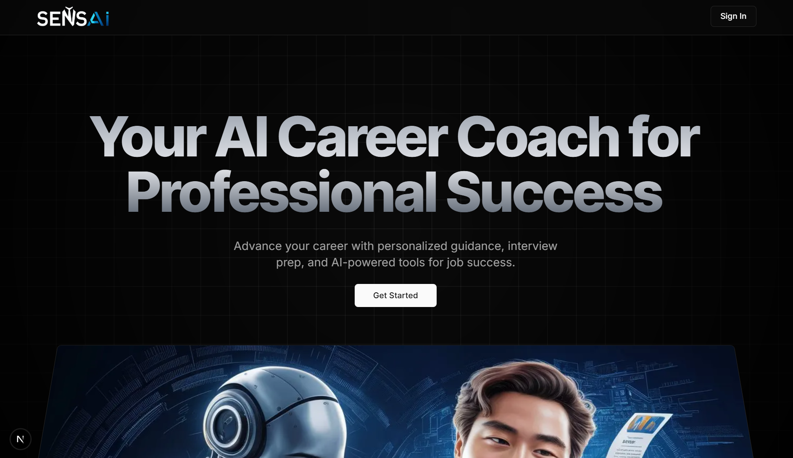
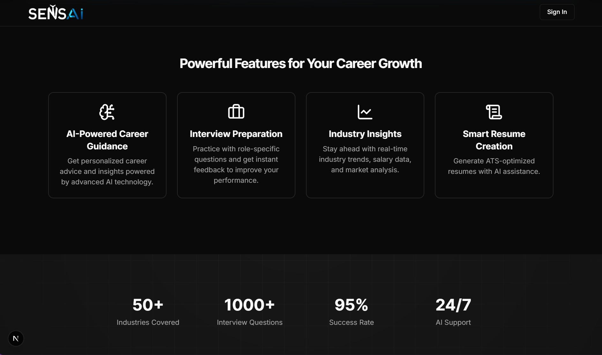
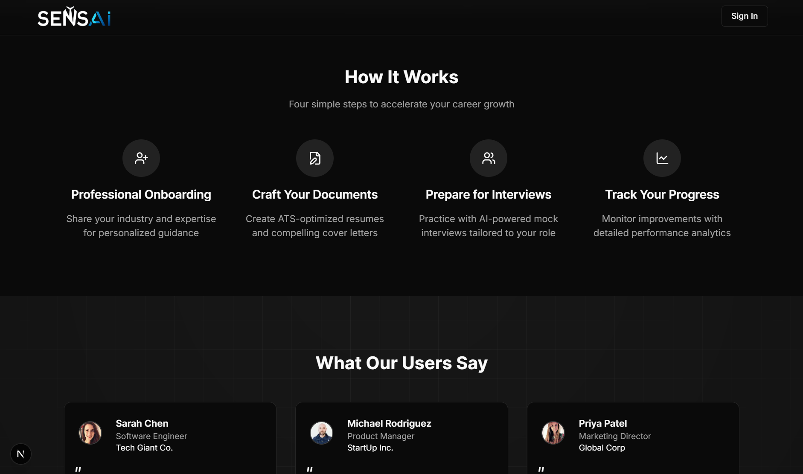
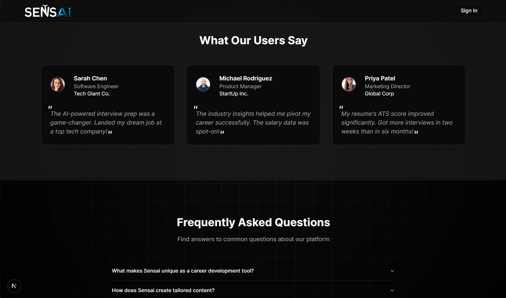
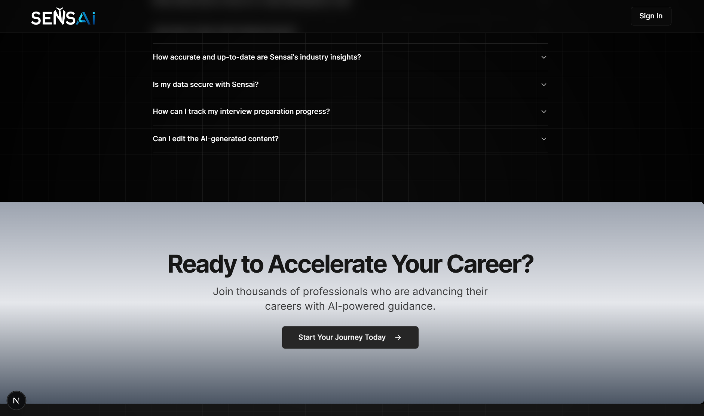
- **Sign In Page**
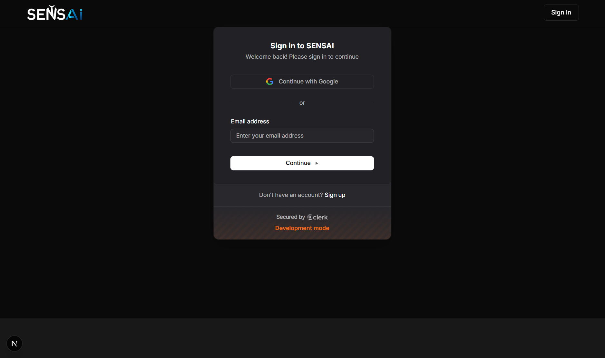
- **After Sign In**
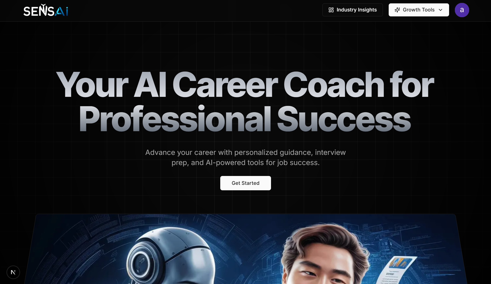
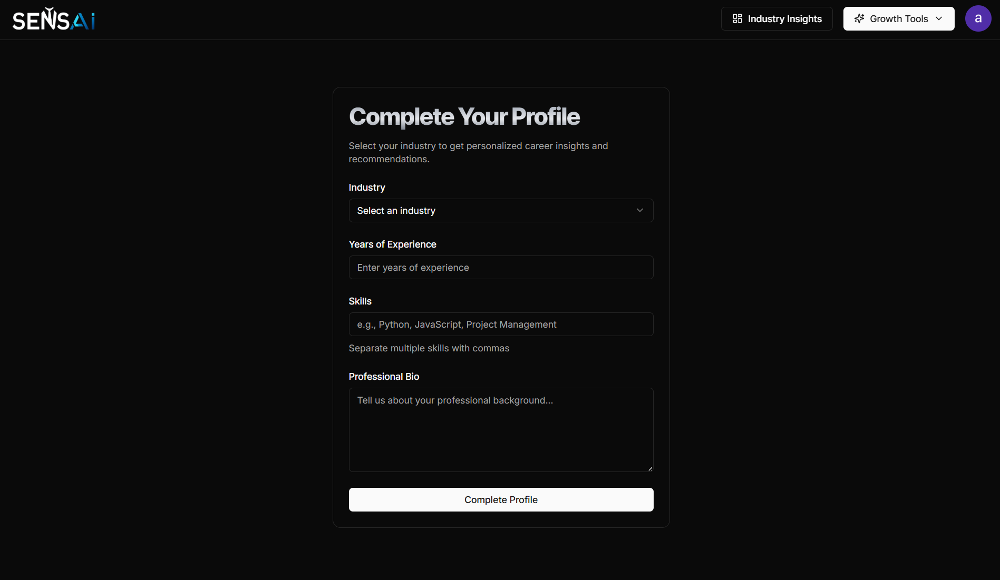
- **Industry Insights**
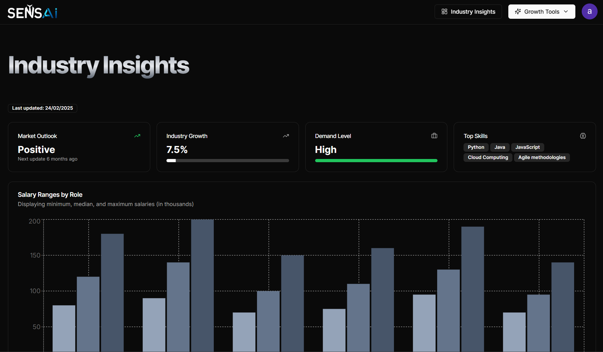
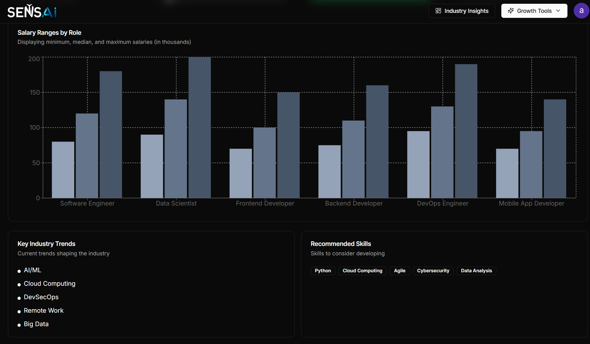
- **Resume Builder**
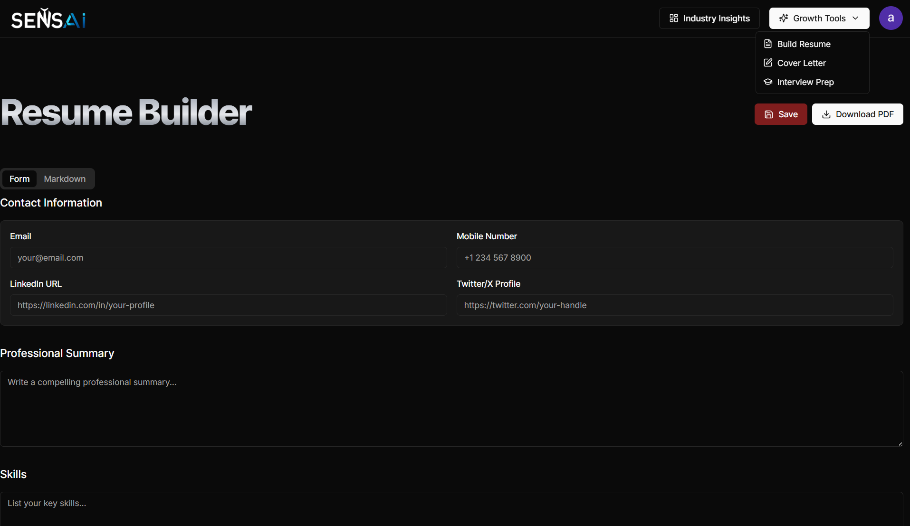
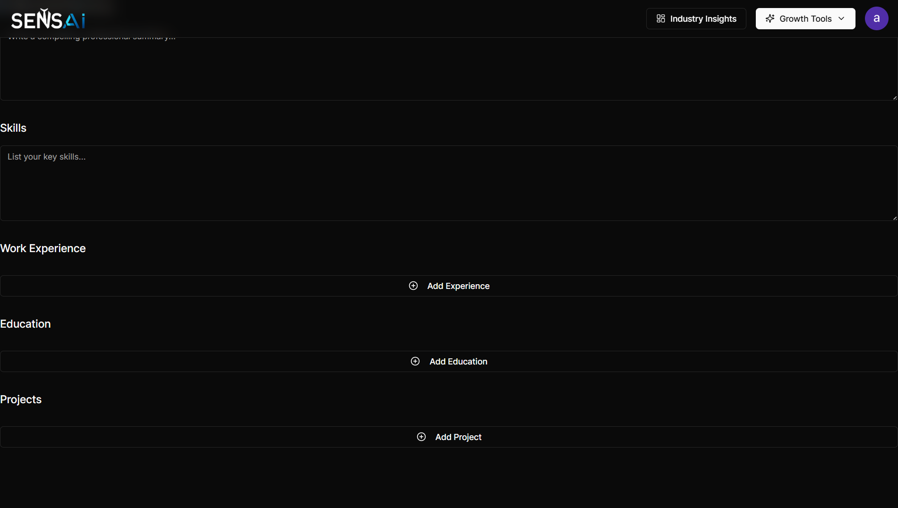
- **Cover Letter Generator**
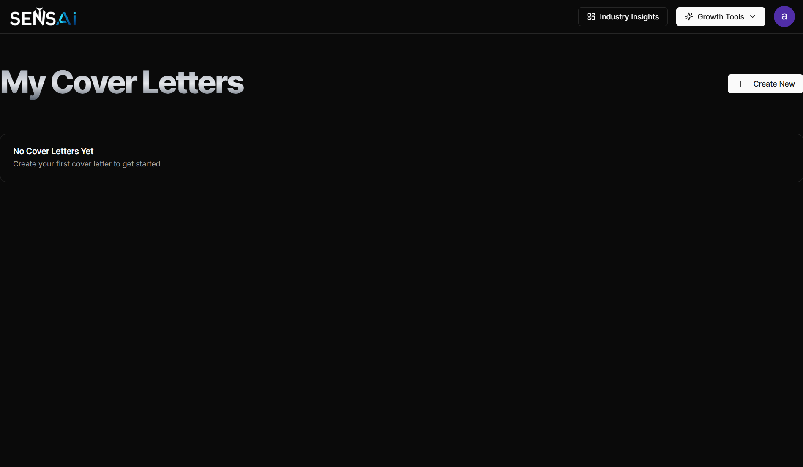
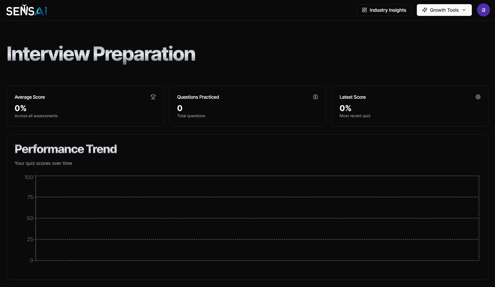
- **Interview Preperation**
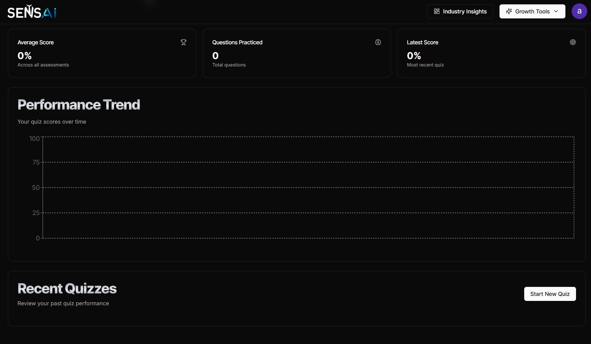
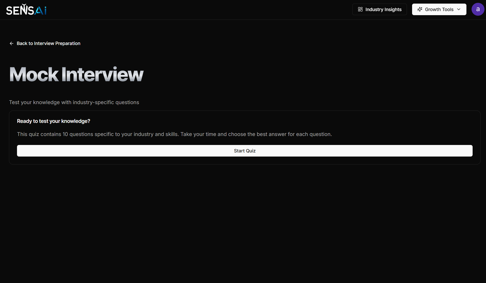
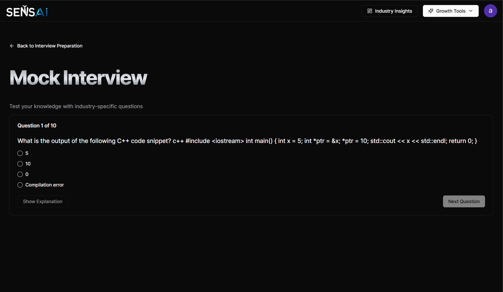

## 2. Overview

The **Full Stack AI Career Coach** is an advanced, AI-powered platform designed to guide you through your career journey. It offers tailored industry insights, dynamic resume and cover letter builders, and interactive interview preparation with quizzes. This application leverages a modern tech stack to provide an engaging and responsive user experience.

## 3. Features

- **User Authentication:** Secure sign-up and login powered by Clerk.
- **Industry Insights Dashboard:** Access detailed market outlooks, industry growth statistics, demand analysis, top skills, salary ranges, and more.
- **Resume Builder:** Create and customize professional resumes with an intuitive interface.
- **Cover Letter Builder:** Craft compelling cover letters using guided templates.
- **Interview Preparation:** Engage in mock interviews and interactive quizzes to sharpen your skills.
- **Background Processing:** Automate tasks and data handling using Inngest.
- **Responsive Design:** Enjoy a fully responsive UI built with Tailwind CSS and Shadcn UI.

## 4. Tech Stack

- **Frontend:**
  - React 19
  - Next.js 15 
  - Tailwind CSS 
  - Shadcn UI 
- **Backend:**
  - Next.js API Routes
  - Prisma ORM
  - NeonDB
- **Authentication:** Clerk Authentication
- **Background Jobs:** Inngest
- **AI & Data Integration:** Gemini API

## 5. Live Demo

Check out the final deployed app on Vercel:  
[Link to website](https://ai-career-coach-nu-five.vercel.app/)

